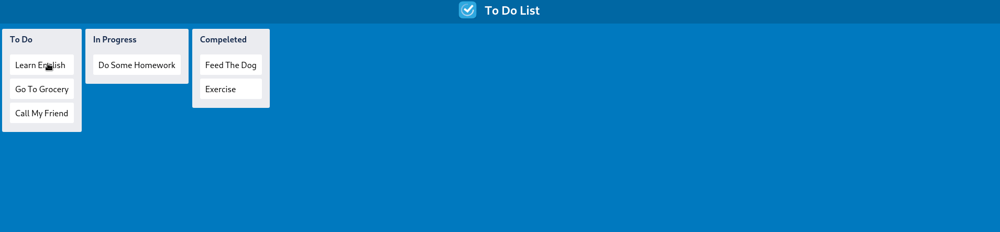

# Project topic: A To-do List like Trello with ReactJS
This project is a simple to-do list that implements the drag-and-drop feature without the use of external libraries.

#### Technologies include:
 * Html-css, React, ES6
## features:
* Three columns include To-do, In Progress and Completed
* Multiple sample and static tasks in each column
* Moving tasks between columns with the mouse
* Only with Reactjs

### See Demo URL- [Todo List App](https://nda-kd.github.io/Reactjs-dnd-todo-list/)


### Installation
``` 
$ git clone https://github.com/nda-kd/Reactjs-dnd-todo-list.git
```
